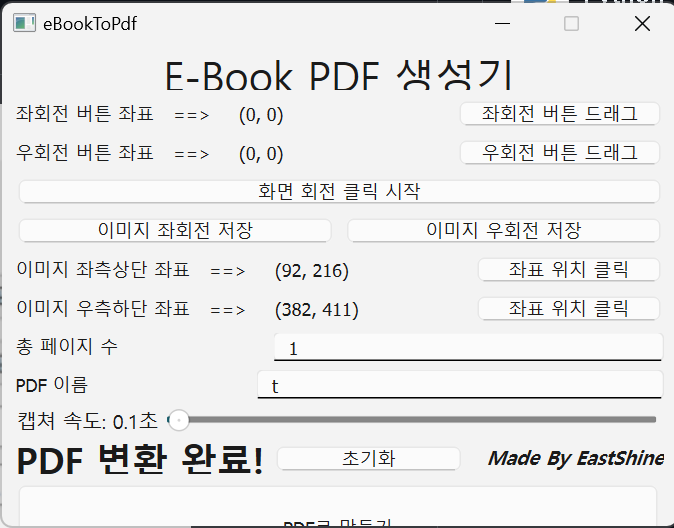

# eBookToPdf
E-Book PDF 추출 ~~프로그램~~ 파이썬 스크립트

회전 기능을 더했습니다.

- 이유
  OCR 을 위한 해상도가 아쉬워서 가로로 돌려서 캡처한 후 pdf 제작 전 다시 원래대로 돌려놓고 싶었어요.
- 결과
  - [X] 화면에 보이는 뷰어에 좌회전, 우회전 버튼 위치를 드래그앤 드롭으로 알아냅니다.
  - [X] 전체 페이지를 키보드 우측키로 순회하며 매번 캡처한 회전 버튼을 눌러 화면을 회전시킵니다.
  - [X] 회전된 이미지가 저장되기 전 다시 회전시킬 수 있는 버튼을 선택할 수 있습니다.
  - [X] 저장 전 회전시킬 방향 버튼을 선택하고, 기존처럼 캡쳐 & PDF 제작을 진행하면 최종적으로 최전된 이미지로 PDF 생깁니다.
- 주의
  - 변수명을 숫자로 처리하는데 인지적으로 어려움을 겪어서 변수 네이밍이 원 저작자 분과 제 것이 섞여있습니다.
  - QT를 한번도 써본 적이 없어서 기능은 만들었는데 위아래 높이를 더하지 못해 버튼이 약간씩 짤려서 나옵니다.
  - 실행파일을 빌드하지 않았습니다. 필요하면 이슈에 요청 남겨주세요. 누군가 빌드 해주시면 좋겠습니다.

원 저작자님 감사합니다. 덕분에 회전기능 더해서 더 정확한 OCR 결과를 얻을 수 있는 고해상도 PDF 를 얻게되었네요.
원 저작자 제작 과정 : https://eastshine12.tistory.com/55
   

# 프로그램 화면

   

# 실행파일 위치
~~eBookToPdf/dist/ebook_to_pdf.exe~~

저에게는 당장 EXE 파일로 필요하지 않아서 만들지 않은 상태입니다.

   

# 사용법

## 뷰어 책 페이지 방향 회전
1. 좌회전 버튼, 우회전 버튼 드래그 중 하나를 누른 후 뷰어의 아이콘을 영역을 좌상단에서 우하단으로 드래그 합니다.
2. 누른 버튼에 좌표가 입력되며 나머지 버튼은 비활성화 됩니다.
3. 총 페이지 수에 방향을 바꿀 페이지 개수를 입력합니다.
4. 화면 회전 클릭 시작 버튼을 누릅니다.
5. 현재 화면부터 총 페이지 수까지 한 페이지씩 우측 키로 넘어가며 페이지를 회전시킵니다.
6. 작업이 끝나면, 다시 처음 화면으로 돌아옵니다.

## 캡쳐
1. '좌표 위치 클릭' 버튼 클릭 후 캡처할 영역의 좌측상단, 우측하단 좌표를 구한다.
2. 총 페이지 수와 생성할 PDF 이름을 작성한다.
3. 다음 페이지를 넘겨보며 화면이 완전히 랜더링되는 시간을 참고하여 캡처 속도를 조절한다.
4. 현재 보는 방향으로 캡쳐하지만, PDF 는 다른 방향으로 회전해서 만들고 싶으면, 이미지 좌회전 혹은 우회전 저장을 선택한다.
5. PDF로 만들기 클릭!
6. 캡처 이미지가 많아지면, PDF 변환 시간이 길어질 수 있으므로 잠시 기다린다.
7. 'PDF 변환 완료!'라는 문구가 뜨면 PDF 생성이 완료된 것이다.
8. PDF 파일은 실행 파일과 같은 경로에 생성된다.
   

# 사용 시 유의사항
1. 해당 프로그램은 windows 전용 ~~app~~ 파이썬 스크립트다.
2. 이미지 좌표 영역이 뷰어 영역을 벗어나면 안된다.
3. 반드시 키보드 오른쪽 방향키를 통해 다음 페이지 전환이 되어야 한다.
4. 페이지 수가 많을 경우 PDF 용량이 꽤 되므로 HDD 용량이 여유가 있어야 한다.
5. PDF 재생성 오류 시 프로그램을 재실행한다.
